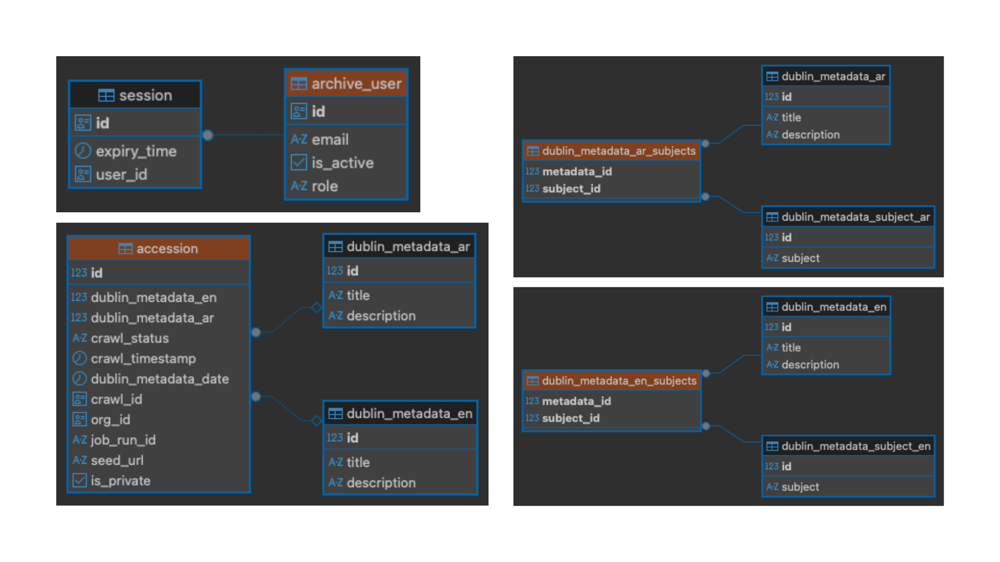
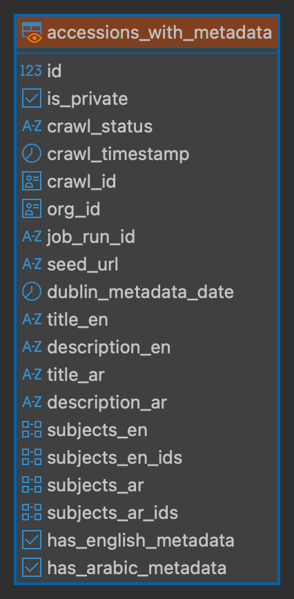

# Entity Relation Diagrams

This section contains autogenerated entity relationship diagrams 
for the schemas in the postgres database.

To generate these schema, I used dbeaver and then stitched the different schema together in canva. 
You can follow the installation instructions 
[here](https://dbeaver.com/docs/dbeaver/Installation/#overview).

## Tables

This section denotes the tables where the data is stored. In practice most queries hit a view
since that makes it easier to work with all the relationships in the data.

## Views

This logical view combines the accessions with various associated metadata.

