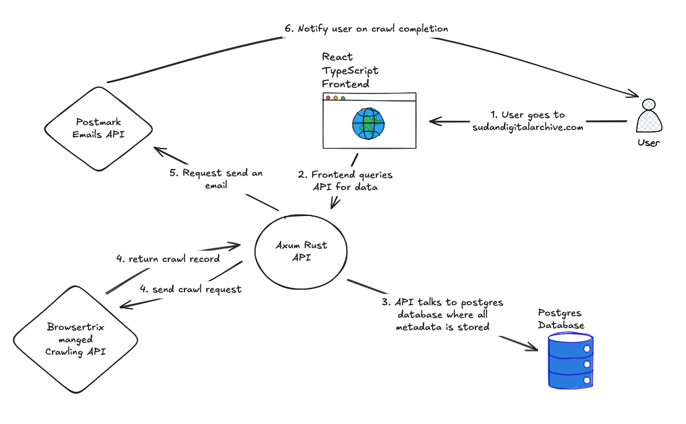

# Software Design Overview

The below diagram details the overall system architecture:

Note that this flow is for what happens when a logged in user queries data and triggers a crawl, since this illustrates all the components
in the stack.

## Components

- The frontend [codebase](https://github.com/Sudan-Digital-Archive/sudan-digital-archive-frontend)
- The API [codebase](https://github.com/Sudan-Digital-Archive/sudan-digital-archive-api). Note there
  is a full Open API spec available on the redoc site 
  [here](https://api.sudandigitalarchive.com/sda-api/redoc).
- Browsertrix API refers to [browsertrix](https://browsertrix.com/). You can see their swagger API docs 
  [here](https://app.browsertrix.com/api/docs)
- Postmark API refers to [postmark](https://postmarkapp.com/)
- The frontend, API, and postgres database all live on digital ocean. See the [infrastructure](../infrastructure-design/index.md) section for more information